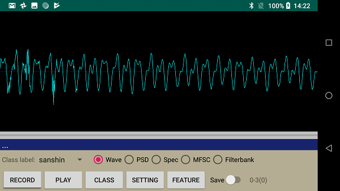
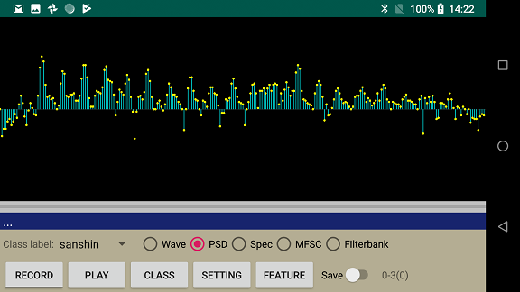
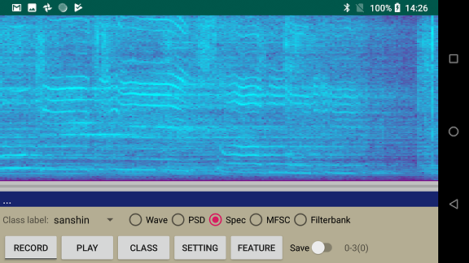
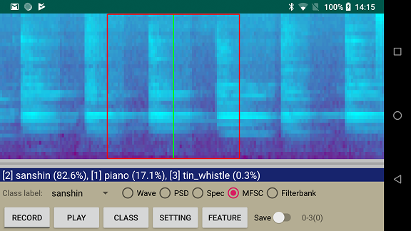
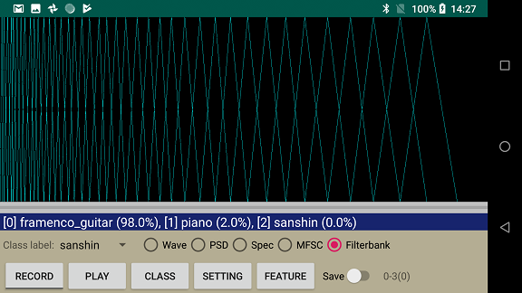

# Screenshots of android app "spectrogram"

The following "audio features" are screen shots of the android app that captured features of ["Shimauta"](https://en.wikipedia.org/wiki/Shima_Uta_(The_Boom_song)) song played by a popluar female singer.

## Wave form of Sanshin

## Power Spectrum Density

## Spectrogram of vocal and Sanshin

## Mel-frequency spectral coefficients

I trained a CNN model for musical instruments recognition and ran it on the Android app.

## Mel-filterbank

